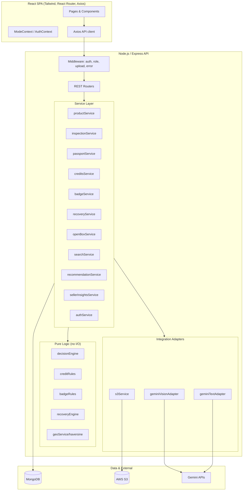
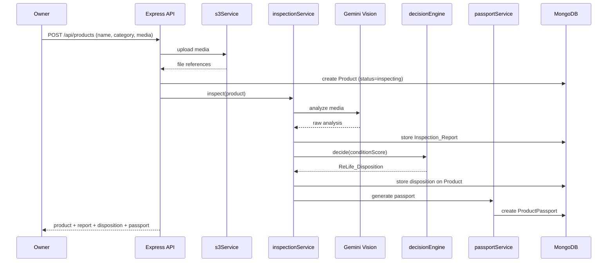

# Design Document

## Overview

Amazon ReLife is a circular-commerce layer that sits inside the Amazon shopping experience. It is delivered as a full-stack web application with a React single-page frontend, a Node.js/Express REST API, and a MongoDB datastore. The system lets owners list non-return-eligible products, runs AI-driven condition inspection (Gemini Vision), generates trust records (Product Passports), and decides each product's best "next life" (Resell, Refurbish, Donate, Recycle). It intelligently routes low-value returns between the seller and nearby recovery hubs, publishes recovered items as Amazon Certified Open Box inventory, rewards sustainable behavior with Green Credits and Circular Citizen badges, surfaces nearby ReLife products inside unified search, and gives sellers AI-generated review/return intelligence.

The design separates concerns into three layers:

- **Presentation layer (React SPA)** — pages, card components, mode switching, search, and dashboards. Talks only to the REST API via Axios.
- **Application/service layer (Express)** — routers that expose REST endpoints and delegate to focused services. The core business engines (decision engine, green credits, badge tiering, recovery routing, distance calculation) are implemented as **pure functions** with no I/O so they can be exhaustively property-tested.
- **Data and integration layer** — MongoDB collections, AWS S3 for media, and the Gemini Vision API for inspection and the Gemini text model for seller intelligence.

### Key Design Principles

1. **Pure business logic.** The decision engine, credit arithmetic, badge tiering, recovery ratio routing, and Haversine distance are deterministic pure functions. They take plain inputs and return plain outputs, isolated from MongoDB, S3, and HTTP. This makes the most correctness-critical logic unit- and property-testable.
2. **Thin controllers.** Express route handlers validate input, call services, and shape responses. They contain no business rules.
3. **Integration isolation.** Gemini and S3 are accessed through adapter modules with a single responsibility, so they can be mocked in tests and swapped without touching business logic.
4. **Stateless auth.** JWT bearer tokens carry identity and role, enabling horizontal scaling without server-side session storage.

### Requirements Coverage Map

| Requirement | Primary components |
|---|---|
| R1 Mode switching | Frontend `ModeContext`, `ModeToggle`, tabbed marketplace |
| R2 Unified search w/ nearby | `Search_Service`, `geoService.haversine` |
| R3 Product upload | `productRouter`, `productService`, `s3Service`, `uploadMiddleware` |
| R4 AI inspection | `inspectionService`, `geminiVisionAdapter` |
| R5 Product Passport | `passportService` |
| R6 Decision engine | `decisionEngine` (pure) |
| R7 Green Credits | `creditsService`, `creditRules` (pure) |
| R8 Badges | `badgeService`, `badgeRules` (pure) |
| R9 Recovery routing | `recoveryEngine` (pure) + `recoveryService` |
| R10 Open Box | `openBoxService`, `Search_Service` |
| R11 Recommendation | `recommendationService`, `geoService` |
| R12 Seller intelligence | `sellerInsightsService`, `geminiTextAdapter` |
| R13 Auth/authorization | `authService`, `authMiddleware`, `roleMiddleware` |
| R14 Pages/responsive UI | React pages + Tailwind responsive layout |

## Architecture

### High-Level Architecture



### Request Lifecycle

1. The React client attaches a JWT bearer token (when authenticated) to each Axios request.
2. `authMiddleware` verifies the token and populates `req.user` (id + role); `roleMiddleware` enforces role-specific access where required.
3. For media uploads, `uploadMiddleware` (multer, memory storage) parses multipart form data before the router runs.
4. The router validates the request body, then calls one or more services.
5. Services orchestrate pure logic, adapters (Gemini/S3), and MongoDB access, then return domain objects.
6. The router serializes the result to JSON; the central `errorMiddleware` converts thrown errors into consistent error responses.

### Listing & Inspection Pipeline (sequence)



### Technology Stack

- **Frontend:** React 18, React Router 6, Tailwind CSS, Axios, Vite (build/dev server).
- **Backend:** Node.js (LTS), Express.js, Mongoose (MongoDB ODM), jsonwebtoken, bcrypt, multer, @aws-sdk/client-s3, @google/generative-ai.
- **Database:** MongoDB with collections Users, Products, ProductPassports, RecoveryProducts, SellerInsights, Credits, Badges.
- **Storage:** AWS S3 for uploaded images/video.
- **AI:** Gemini Vision API (image/video condition analysis) and Gemini text model (seller intelligence summarization).
- **Testing:** Vitest/Jest + a property-based testing library (`fast-check`) for the pure engines.

## Components and Interfaces

### Backend: Middleware

- **`authMiddleware(req,res,next)`** — Extracts the `Authorization: Bearer <token>` header, verifies the JWT, and sets `req.user = { id, role }`. Responds `401` when missing/invalid (Requirement 13.2, 13.3).
- **`roleMiddleware(...allowedRoles)`** — Guards routes by role (e.g., `seller`). Responds `403` when `req.user.role` is not allowed (Requirement 13.4).
- **`uploadMiddleware`** — Multer configured with memory storage and limits (file count, size, mime types image/* and video/*). Exposes `req.files`. Always mounted **after** `authMiddleware` on the product-upload route so that every upload requires a verified authenticated session with no guest or temporary-access exception (Requirement 3.1, 3.2, 13.5).
- **`errorMiddleware(err,req,res,next)`** — Maps `AppError` subclasses to status codes and a uniform error body; logs unexpected errors and returns `500`.
- **`validate(schema)`** — Request-body validation (e.g., zod/joi) that throws `ValidationError` with the offending field (Requirement 3.3, 3.4).

### Backend: Routers (REST surface)

Each router is thin and delegates to services.

- `authRouter` — `/api/auth`
- `productRouter` — `/api/products`
- `inspectionRouter` — `/api/products/:id/inspection`
- `passportRouter` — `/api/products/:id/passport`
- `searchRouter` — `/api/search`
- `recommendationRouter` — `/api/recommendations`
- `creditsRouter` — `/api/credits`
- `badgeRouter` — `/api/badges`
- `recoveryRouter` — `/api/returns`, `/api/recovery`
- `openBoxRouter` — `/api/openbox`
- `sellerRouter` — `/api/seller/insights`

### Backend: Pure Logic Modules (no I/O)

These are the correctness-critical functions. They are deterministic and side-effect free.

**`decisionEngine.decide(conditionScore) -> ReLife_Disposition`** (Requirement 6)
```
decide(score):
  if score > 85  -> "Resell"
  if score >= 65 (and <= 85) -> "Refurbish"
  if score >= 35 (and < 65)  -> "Donate"
  else (score < 35) -> "Recycle"
```
Boundary contract (from requirements): `>85` Resell, `65..85` inclusive Refurbish, `35..<65` Donate, `<35` Recycle. Score domain is integer 0–100. `decide` is the single source of truth for the disposition: the engine validates any candidate disposition against the Condition_Score range and, if a candidate does not match the range, overrides it with the disposition that `decide(score)` returns before storing it on the product record (Requirement 6.6). This guarantees the stored disposition always matches the score range.

**`creditRules.creditsFor(action) -> integer`** (Requirement 7)
```
Resell           -> +100
Donate           -> +150
Recycle          -> +75
BuyRefurbished   -> +50
Return           -> 0  (balance unchanged)
```
`creditRules.applyAction(balance, action) -> newBalance` returns `balance + creditsFor(action)`; `Return` yields the same balance. Because each action is scored independently by `creditsFor`, a `Return` action awards zero and leaves the balance unchanged (Requirement 7.5), while a Resell, Donate, Recycle, or BuyRefurbished action in the same session is still credited its full delta (Requirement 7.6) — a return never cancels credits earned by other voluntary actions.

**`badgeRules.badgeFor(balance) -> Badge | null`** (Requirement 8) — Returns the highest tier earned for a balance:
```
balance >= 1000 -> "Gold Circular Citizen"
balance >= 500  -> "Silver Circular Citizen"
balance >= 100  -> "Bronze Circular Citizen"
else            -> null
```
`badgeRules.newlyEarned(prevBalance, newBalance) -> Badge[]` returns badge tiers whose threshold is `> prevBalance` and `<= newBalance` (used to record awards once when a threshold is crossed). Earned badges are stored in the Badges collection independently of the live balance, so `badgeFor` is used only to compute *new* awards; it never removes previously recorded tiers. A balance that later drops below a threshold therefore does not revoke an already-earned badge (Requirement 8.7), and a user who has crossed no threshold holds — and is shown — no badge (Requirement 8.6).

**`recoveryEngine.route(conditionScore, productValue, logisticsCost, threshold=2.0) -> RoutingResult`** (Requirement 9)
```
if conditionScore < 90 -> { eligible:false, decision:"Return To Seller", ratio:null }
else (>=90):
  eligible = true
  ratio = productValue / logisticsCost
  if ratio >= threshold -> decision:"Return To Seller"
  else                  -> decision:"Nearby Recovery Hub"
```

**`geoService.haversine(a, b) -> kilometers`** (Requirements 2, 11) — Great-circle distance between two `{lat,lng}` points. Symmetric, non-negative, zero for identical points.

### Backend: Services (orchestration + I/O)

- **`authService`** — `register`, `login` (bcrypt compare → sign JWT), `verify`. (Requirement 13)
- **`productService`** — Creates product records, associates owner and S3 media references, validates required fields/media. (Requirement 3)
- **`inspectionService`** — Sends media to `geminiVisionAdapter`, builds the `Inspection_Report`, clamps/validates `Condition_Score` to 0–100, persists report, records a failure status when the Gemini call errors or times out **and** when the Gemini call responds successfully but returns unusable data (invalid JSON or a response missing required `Inspection_Report` fields). Invokes `decisionEngine` and `passportService`. (Requirement 4)
- **`passportService`** — Builds and stores Product Passport including ownership/repair history and inspection data; serves passport lookups with not-found semantics. (Requirement 5)
- **`creditsService`** — Applies `creditRules`, persists a Credits transaction, then calls `badgeService` to evaluate new tiers. A `Return` action records a zero-credit transaction and leaves the balance unchanged; every other voluntary action (Resell, Donate, Recycle, BuyRefurbished) is credited independently, so a return occurring in the same session never cancels the credits earned by those other actions. (Requirement 7)
- **`badgeService`** — Uses `badgeRules.newlyEarned`, persists awarded badges idempotently, exposes highest tier for profile. Awarded badges are persisted in the Badges collection independently of the current Green_Credits balance: once a tier is earned its record is never removed, so a later balance drop below a threshold does not revoke the badge; when a user holds no badge no badge is exposed for the profile. (Requirement 8)
- **`recoveryService`** — Requests inspection for returned product, calls `recoveryEngine`, persists `RecoveryProducts` record; on "Nearby Recovery Hub" triggers `openBoxService`. (Requirement 9, 10)
- **`openBoxService`** — Publishes recovery-hub products as Open Box with Amazon Certified label, exposes condition/report/passport/price. (Requirement 10)
- **`searchService`** — Queries new + ReLife + Open Box products, computes distances via `geoService`, orders ReLife results by ascending distance, omits distance when buyer location is unavailable. Whenever matching new products exist they are always included in the result set, even if matching ReLife products also exist (Requirement 2.2). (Requirements 2, 10.4)
- **`recommendationService`** — Finds query-relevant ReLife products, selects nearest, returns the "Similar ReLife Product Available Near You" recommendation or none. (Requirement 11)
- **`sellerInsightsService`** — Aggregates reviews/ratings/return reasons, calls `geminiTextAdapter` to summarize, computes dominant complaint percentage, persists insights, returns empty-insights when no feedback exists. (Requirement 12)

### Backend: Integration Adapters

- **`geminiVisionAdapter.analyze(media[]) -> RawAnalysis`** — Calls Gemini Vision with a structured prompt requesting condition score, scratches, damage, missing components, and expected lifespan; enforces a configurable timeout; throws `InspectionError` on failure/timeout, and also on a successful API response whose payload is unusable — invalid JSON or missing required `Inspection_Report` fields (Requirement 4.1, 4.5, 4.6).
- **`geminiTextAdapter.summarizeFeedback(feedback) -> { summary, topComplaints, suggestions, dominantCategory, dominantPercentage }`** — Calls the Gemini text model with aggregated feedback. (Requirement 12)
- **`s3Service.upload(buffer, meta) -> { key, url }`** and **`getUrl(key)`** — Stores media in S3 and returns a reference. (Requirement 3.2)

### Frontend: Pages, Routing, Components

React Router routes (Requirement 14.1):

| Route | Page | Auth |
|---|---|---|
| `/` | Home | public |
| `/search` | Search | public |
| `/relife` | Amazon ReLife Marketplace | public |
| `/upload` | Upload Product | required |
| `/products/:id` | Product Details | public |
| `/products/:id/passport` | Product Passport | public |
| `/seller` | Seller Dashboard | required (seller) |
| `/recovery` | Recovery Hub Dashboard | required |
| `/profile` | Profile | required |
| `/credits` | Credits & Badges | required |
| `/login`, `/register` | Auth | public |

The Product Passport view is reachable only through a link on the Product Details page; no other page (search results, marketplace cards, profile) exposes an entry point to the passport, so passport access is provided exclusively from Product Details (Requirement 14.3).

Cross-cutting frontend state:

- **`AuthContext`** — current user, role, JWT; `ProtectedRoute` wrapper redirects unauthenticated users (Requirement 13.3).
- **`ModeContext`** — holds `New_Products_Mode` | `ReLife_Mode`, defaults to `New_Products_Mode` when the buyer has not selected a mode (Requirement 1.6); `ModeToggle` control sets the mode; marketplace renders New vs ReLife products in separate tabs (Requirement 1.5). While `New_Products_Mode` is active the marketplace renders **only** new products and never ReLife products, so switching to New Products Mode strictly excludes second-life listings from the active view (Requirement 1.4).

Reusable components:

- **`ProductCard`** — Displays product, price, and always shows `Condition_Score` for ReLife items; ReLife variant shows distance + "Similar ReLife Product Available Near You" badge (Requirements 2.3, 11.3, 14.2).
- **`OpenBoxBadge`** — "Amazon Certified Open Box" label.
- **`ConditionBadge`** — Color-coded condition indicator.
- **`SearchBar`**, **`PassportView`**, **`CreditsPanel`**, **`BadgeShelf`**, **`InsightsPanel`**.
- **Responsive layout** — Tailwind breakpoints (`sm`/`md`/`lg`) provide a fluid grid that adapts desktop ↔ mobile (Requirement 14.5).

## Data Models

MongoDB collections via Mongoose schemas. All documents include `createdAt`/`updatedAt` timestamps.

### Users

```js
{
  _id: ObjectId,
  name: String,                 // required
  email: String,                // required, unique, indexed
  passwordHash: String,         // bcrypt
  role: String,                 // "buyer" | "owner" | "seller"  (a user may act as buyer + owner)
  location: { lat: Number, lng: Number } | null,  // for nearby search/recommendations
  greenCredits: Number,         // non-negative integer, default 0
  highestBadge: String | null,  // denormalized highest tier for fast profile render (Req 8.5)
  createdAt, updatedAt
}
```

### Products

```js
{
  _id: ObjectId,
  ownerId: ObjectId,            // ref Users (Req 3.5)
  sellerId: ObjectId | null,    // ref Users, for seller-owned catalog (Req 12)
  name: String,                 // required (Req 3.4)
  category: String,             // required (Req 3.4)
  price: Number,
  media: [{ key: String, url: String, type: "image"|"video" }], // >=1 required (Req 3.1-3.3)
  source: String,               // "relife" | "new" | "openbox"
  location: { lat: Number, lng: Number } | null,
  conditionScore: Number | null,   // 0-100 integer once inspected
  disposition: String | null,      // "Resell"|"Refurbish"|"Donate"|"Recycle" (Req 6.5)
  inspectionStatus: String,        // "pending"|"inspecting"|"complete"|"failed" (Req 4.5)
  inspectionReportId: ObjectId | null,
  passportId: ObjectId | null,
  openBox: { certified: Boolean, label: String } | null, // (Req 10.1)
  reviews: [{ rating: Number, text: String }],            // for seller insights (Req 12)
  returnReasons: [String],
  createdAt, updatedAt
}
```
Indexes: `{ ownerId }`, `{ sellerId }`, `{ source }`, text index on `{ name, category }` for search, `2dsphere`/coordinate fields for proximity (or in-memory Haversine on candidate set).

### ProductPassports

```js
{
  _id: ObjectId,
  productId: ObjectId,          // ref Products, unique
  productName: String,
  category: String,
  ownershipHistory: [{ userId: ObjectId, name: String, from: Date }],  // (Req 5.3)
  repairHistory: [{ description: String, date: Date }],
  inspectionReport: {
    conditionScore: Number,     // 0-100 (Req 4.3)
    scratchAnalysis: String,
    damageDetection: String,
    missingComponents: [String],
    expectedLifespanMonths: Number
  },
  conditionScore: Number,
  expectedLifespanMonths: Number,
  createdAt, updatedAt
}
```

### RecoveryProducts

```js
{
  _id: ObjectId,
  productId: ObjectId,          // returned product
  returningCustomerId: ObjectId,
  conditionScore: Number,       // from inspection (Req 9.1)
  recoveryEligible: Boolean,    // conditionScore >= 90 (Req 9.3)
  productValue: Number,
  logisticsCost: Number,
  recoveryRatio: Number | null, // productValue / logisticsCost when eligible
  routingDecision: String,      // "Return To Seller" | "Nearby Recovery Hub" (Req 9.2,9.4,9.5)
  recoveryHubId: ObjectId | null,
  createdAt, updatedAt
}
```

### SellerInsights

```js
{
  _id: ObjectId,
  productId: ObjectId,
  sellerId: ObjectId,
  reviewSummary: String,
  topComplaints: [{ category: String, percentage: Number }],   // (Req 12.3)
  improvementSuggestions: [String],
  dominantComplaint: { category: String, percentage: Number } | null,
  empty: Boolean,               // true when no feedback existed (Req 12.5)
  createdAt, updatedAt
}
```

### Credits

```js
{
  _id: ObjectId,
  userId: ObjectId,
  action: String,    // "Resell"|"Donate"|"Recycle"|"BuyRefurbished"|"Return"
  amount: Number,    // credits delta for this action (Req 7.1-7.5)
  balanceAfter: Number,
  createdAt
}
```

### Badges

```js
{
  _id: ObjectId,
  userId: ObjectId,
  tier: String,        // "Bronze Circular Citizen"|"Silver..."|"Gold..."
  thresholdAt: Number, // 100 | 500 | 1000
  awardedAt: Date
}
```
Unique compound index `{ userId, tier }` ensures a tier is awarded at most once (idempotent awards, Req 8.4).

### REST API Design

All responses are JSON. Errors use `{ error: { code, message, field? } }`.

**Auth** (Requirement 13)
- `POST /api/auth/register` → `{ user, token }`
- `POST /api/auth/login` → `{ user, token }` | `401`

**Products & Inspection** (Requirements 3, 4, 6)
- `POST /api/products` (auth required — no guest exception, Req 13.5; multipart) → creates product, stores media, runs inspection + decision + passport → `201 { product, inspectionReport, disposition, passport }`; `400` on missing name/category/media; `401` when unauthenticated.
- `GET /api/products/:id` → product details.
- `POST /api/products/:id/inspection` (auth) → re-runs inspection; `502` on Gemini failure with descriptive error.
- `GET /api/products/:id/inspection` → report.

**Passport** (Requirement 5)
- `GET /api/products/:id/passport` → passport | `404` when none exists.

**Search & Recommendations** (Requirements 2, 10.4, 11)
- `GET /api/search?q=&lat=&lng=&mode=` → `{ newProducts[], relifeProducts[], openBoxProducts[], recommendation? }`; ReLife results ordered by ascending distance; distance omitted when location absent.
- `GET /api/recommendations?q=&lat=&lng=` → `{ recommendation | null }`.

**Credits & Badges** (Requirements 7, 8)
- `POST /api/credits/actions` (auth) → `{ action }` applies credit rule, records transaction, evaluates badges → `{ balance, newBadges[] }`.
- `GET /api/credits` (auth) → `{ balance, transactions[] }`.
- `GET /api/badges` (auth) → `{ badges[], highestBadge }`.

**Returns & Recovery / Open Box** (Requirements 9, 10)
- `POST /api/returns` (auth) → inspects + routes → `{ recoveryProduct }`.
- `GET /api/recovery` (auth) → recovery hub dashboard inventory.
- `GET /api/openbox/:id` → `{ product, conditionScore, inspectionReport, passport, price }`.

**Seller Intelligence** (Requirement 12, 13.4)
- `GET /api/seller/insights/:productId` (auth, role=seller, owner-scoped) → insights | empty-insights result; `403` if product not owned by requesting seller.

### Gemini Vision Integration Approach

`geminiVisionAdapter` builds a multimodal request: the uploaded media (image bytes/video reference) plus a structured instruction prompt that asks the model to return JSON with fields `conditionScore` (0–100 integer), `scratchAnalysis`, `damageDetection`, `missingComponents` (array), and `expectedLifespanMonths`. The adapter:

1. Loads media (from S3 reference or in-memory buffer for just-uploaded files).
2. Calls Gemini with a request-level timeout (`GEMINI_TIMEOUT_MS`, default ~20s).
3. Parses and validates the JSON response; coerces/clamps `conditionScore` to an integer within 0–100 (Requirement 4.3). Validation confirms the response is well-formed JSON and contains every required `Inspection_Report` field (condition score, scratch analysis, damage detection, missing components, expected lifespan).
4. Throws `InspectionError` on three failure modes: (a) an API error, (b) a timeout, or (c) a successful API response whose payload is unusable — non-JSON output or a response missing required `Inspection_Report` fields. In every case `inspectionService` sets `inspectionStatus="failed"` and surfaces a descriptive error (Requirements 4.5, 4.6).

`geminiTextAdapter` uses the Gemini text model with aggregated review/return text and a prompt requesting `summary`, `topComplaints[]` with category + percentage, `improvementSuggestions[]`, and the dominant complaint (Requirement 12).

### S3 Upload Flow

1. Client posts multipart form data to `POST /api/products`; `uploadMiddleware` (multer memory storage) exposes `req.files`.
2. `productService` validates at least one image/video is present (Requirement 3.3) and required text fields exist (Requirement 3.4).
3. For each file, `s3Service.upload` puts the object under a key like `relife/{ownerId}/{productId}/{uuid}` and returns `{ key, url }`.
4. References are stored on `Products.media`; if all uploads succeed the product is persisted, otherwise the request fails and any partial uploads are best-effort cleaned up.
5. Media is served via the stored URL (or signed URL via `s3Service.getUrl`).

### Distance Calculation Approach

`geoService.haversine(a, b)` computes great-circle distance in kilometers using the Haversine formula on `{lat,lng}` pairs (Earth radius 6371 km). Search/recommendation flow:

1. Candidate ReLife/Open Box products are queried by relevance to `q`.
2. When a buyer `location` is provided, each candidate's distance is computed and results are sorted ascending by distance (Requirements 2.4, 11.2).
3. When buyer location is absent, results are returned without a distance field (Requirement 2.6).

## Correctness Properties

*A property is a characteristic or behavior that should hold true across all valid executions of a system — essentially, a formal statement about what the system should do. Properties serve as the bridge between human-readable specifications and machine-verifiable correctness guarantees.*

The properties below target the deterministic, input-varying logic of the system (the pure engines and the search/validation/rendering completeness rules). Pure UI presence checks, external-service wiring, and persistence are covered by example and integration tests in the Testing Strategy instead. Redundant criteria identified in prework have been consolidated.

### Property 1: Decision engine assigns the correct disposition for every condition score

*For any* integer Condition_Score in 0–100, `decisionEngine.decide(score)` returns `Resell` when score > 85, `Refurbish` when 65 ≤ score ≤ 85, `Donate` when 35 ≤ score < 65, and `Recycle` when score < 35 — returning exactly one disposition that matches the score range for every score. Consequently, any candidate disposition that does not match the score range is overridden with the matching disposition.

**Validates: Requirements 6.1, 6.2, 6.3, 6.4, 6.6**

### Property 2: Green Credits arithmetic applies the exact action delta

*For any* non-negative integer balance and any action, `creditRules.applyAction(balance, action)` equals `balance + delta`, where delta is +100 (Resell), +150 (Donate), +75 (Recycle), +50 (BuyRefurbished), and 0 (Return). The resulting balance is never less than the input balance, and because each action's delta is independent, a Return delta of 0 does not reduce the credits awarded by any other voluntary action applied in the same session.

**Validates: Requirements 7.1, 7.2, 7.3, 7.4, 7.5, 7.6**

### Property 3: Badge tiering returns the correct highest tier for any balance

*For any* non-negative balance, `badgeRules.badgeFor(balance)` returns Gold when balance ≥ 1000, Silver when 500 ≤ balance < 1000, Bronze when 100 ≤ balance < 500, and none when balance < 100. The returned tier equals the highest tier among all earned badges for that balance, and no tier is returned when the balance is below every threshold.

**Validates: Requirements 8.1, 8.2, 8.3, 8.5, 8.6**

### Property 4: Badge awards are monotonic, idempotent, and never revoked

*For any* previous balance `p` and new balance `n` with `p ≤ n`, `badgeRules.newlyEarned(p, n)` returns exactly the tiers whose threshold lies in the interval `(p, n]`; awarding badges for the same balance more than once produces no additional badge records (at most one record per tier per user); and a previously recorded badge remains recorded even after a subsequent balance decrease, so earned badges are never revoked.

**Validates: Requirements 8.4, 8.7**

### Property 5: Recovery routing follows the eligibility-then-ratio decision tree

*For any* Condition_Score in 0–100, positive Product Value, and positive Logistics Cost, `recoveryEngine.route(score, value, cost, 2.0)` marks the product Recovery Eligible iff score ≥ 90; when not eligible the decision is `Return To Seller` with no ratio; when eligible the Recovery_Ratio equals value / cost and the decision is `Return To Seller` iff ratio ≥ 2.0, otherwise `Nearby Recovery Hub`.

**Validates: Requirements 9.2, 9.3, 9.4, 9.5**

### Property 6: ReLife results are ordered by ascending distance when location is available

*For any* buyer Location and any set of ReLife/Open Box products with coordinates, the search and recommendation results are ordered so that each result's Distance from the buyer is less than or equal to the next result's Distance.

**Validates: Requirements 2.4, 11.2**

### Property 7: Distance is omitted when buyer location is unavailable

*For any* set of ReLife products, when no buyer Location is provided, none of the returned ReLife results include a Distance value.

**Validates: Requirements 2.6**

### Property 8: Search includes all matching products of every kind

*For any* catalog and any query, the result set in ReLife mode includes every matching ReLife product and every matching Open Box product, and the new-products result includes every matching new product — matching new products are always returned when they exist, even if matching ReLife products also exist.

**Validates: Requirements 2.1, 2.2, 10.4**

### Property 9: ReLife product results are display-complete

*For any* ReLife product returned by search, the rendered result includes the product name, Condition_Score, price, and (when a buyer Location is available) Distance in kilometers.

**Validates: Requirements 2.3, 14.2**

### Property 10: Submission validation rejects exactly the invalid submissions

*For any* product submission, the system rejects it with a field-identifying validation error iff it is missing a name, missing a category, or has zero image/video media; otherwise it is accepted.

**Validates: Requirements 3.3, 3.4**

### Property 11: Condition score is always an integer within 0–100

*For any* raw numeric score returned by the inspection adapter (including out-of-range or fractional values), the resulting Inspection_Report Condition_Score is an integer with 0 ≤ score ≤ 100.

**Validates: Requirements 4.3**

### Property 12: Inspection report is structurally complete

*For any* successful raw analysis, the generated Inspection_Report contains a Condition_Score, Scratch Analysis, Damage Detection, Missing Components, and Expected_Lifespan.

**Validates: Requirements 4.2**

### Property 13: Inspection failures produce a failure status and descriptive error

*For any* inspection where the Gemini Vision adapter errors, times out, **or** returns a successful response with unusable data (invalid JSON or a payload missing required Inspection_Report fields), the product's inspection status is set to failed and a descriptive error is returned.

**Validates: Requirements 4.5, 4.6**

### Property 14: Product Passport is content-complete and records the owner

*For any* product with an Inspection_Report and an associated owner, the generated Product_Passport contains the Product Name, Category, Ownership History (including that owner), Repair History, Inspection_Report, Condition_Score, and Expected_Lifespan.

**Validates: Requirements 5.2, 5.3**

### Property 15: Passport create/fetch round trip

*For any* product whose passport has been generated, requesting the Product_Passport for that product returns the generated passport.

**Validates: Requirements 5.4**

### Property 16: Hub-routed products are published as Amazon Certified Open Box

*For any* returned product routed to a Nearby Recovery Hub, the published Open_Box_Product is labeled Amazon Certified Open Box.

**Validates: Requirements 10.1**

### Property 17: Open Box display is complete

*For any* Open_Box_Product, the display includes the Condition_Score, Inspection_Report, Product_Passport, and price.

**Validates: Requirements 10.2, 10.3**

### Property 18: Recommendations are relevant to the query

*For any* query and catalog, every ReLife product returned by the Recommendation_Engine satisfies the query-relevance predicate; and when no relevant ReLife product exists, no recommendation is returned.

**Validates: Requirements 11.1, 11.4**

### Property 19: Seller insights output is complete for non-empty feedback

*For any* product with at least one review, rating, or return reason, the produced insights contain a Review Summary, a list of Top Complaints, and a list of Product Improvement Suggestions; and when a dominant complaint category exists, its percentage and a corresponding improvement suggestion are included.

**Validates: Requirements 12.2, 12.3**

### Property 20: Authentication token round trip

*For any* user with valid credentials, the session token issued at login verifies back to exactly that user's id and role.

**Validates: Requirements 13.1**

### Property 21: Seller insight access is owner-scoped

*For any* seller and product, access to the product's Seller Intelligence insights is granted iff the product is owned by that seller.

**Validates: Requirements 13.4**

## Error Handling

### Error Model

A small hierarchy of typed errors carries an HTTP status and a stable error code. The central `errorMiddleware` is the single place that converts errors to responses.

| Error | Status | When | Body code |
|---|---|---|---|
| `ValidationError` | 400 | Missing/invalid name, category, media, or body fields (Req 3.3, 3.4) | `VALIDATION_ERROR` (includes `field`) |
| `AuthenticationError` | 401 | Missing/invalid token or bad credentials (Req 13.2, 13.3) | `UNAUTHENTICATED` |
| `AuthorizationError` | 403 | Role/ownership not permitted (Req 13.4) | `FORBIDDEN` |
| `NotFoundError` | 404 | Missing passport or resource (Req 5.5) | `NOT_FOUND` |
| `InspectionError` | 502 | Gemini Vision error/timeout, or successful response with unusable/incomplete data (Req 4.5, 4.6) | `INSPECTION_FAILED` |
| `IntegrationError` | 502 | S3 or Gemini text failure | `INTEGRATION_ERROR` |
| `AppError` (base)/unexpected | 500 | Uncaught/unknown | `INTERNAL_ERROR` |

Response shape: `{ "error": { "code": string, "message": string, "field"?: string } }`.

### Specific Handling Strategies

- **Media upload partial failure.** If any S3 upload in a submission fails, the product is not persisted and previously uploaded objects for that submission are best-effort deleted to avoid orphans (Req 3.2).
- **Inspection failure.** `geminiVisionAdapter` enforces a timeout and validates JSON and required fields. On an API error, a timeout, or a successful-but-unusable response (invalid JSON or missing required Inspection_Report fields), `inspectionService` sets `inspectionStatus="failed"`, persists the status, and returns a descriptive `InspectionError`; the product remains listed but un-dispositioned (Req 4.5, 4.6).
- **Condition score sanitation.** Out-of-range or fractional model scores are clamped/rounded to an integer in 0–100 before use (Req 4.3, Property 11).
- **Missing passport.** Passport lookups return `404 NOT_FOUND` rather than an empty body (Req 5.5).
- **Empty seller feedback.** When a product has no reviews/ratings/return reasons, the service returns an empty-insights result (`empty: true`) rather than calling Gemini (Req 12.5).
- **Recovery cost guard.** `recoveryEngine` requires a positive Logistics Cost; a non-positive cost is treated as an invalid input (`ValidationError`) to avoid division by zero.
- **Location absence.** Search/recommendation degrade gracefully: distance is omitted and ordering falls back to relevance (Req 2.5).
- **Frontend.** Axios interceptors surface API error codes as user-facing messages; `401` clears the session and redirects to login; protected routes guard before rendering.

## Testing Strategy

### Dual Approach

The system uses both example/integration tests (concrete scenarios, wiring, edge cases) and property-based tests (universal properties across generated inputs). PBT applies because the core engines are pure functions with large input spaces and clear invariants. UI rendering, external-service wiring (Gemini, S3), and simple persistence are covered by example, integration, and snapshot tests rather than PBT.

### Property-Based Testing

- **Library:** `fast-check` (with Vitest/Jest). Properties are not hand-rolled.
- **Iterations:** Each property-based test runs a minimum of 100 generated cases.
- **Traceability:** Each property test is tagged with a comment referencing its design property in the form:
  `// Feature: amazon-relife, Property {number}: {property_text}`
- **Generators:**
  - Condition scores: integers in 0–100 (plus out-of-range/fractional for Property 11).
  - Credit actions: enum of the five actions; balances: non-negative integers.
  - Recovery inputs: score 0–100, positive product value and logistics cost.
  - Geo: latitude −90..90, longitude −180..180; product sets with coordinates; optional buyer location.
  - Catalogs: mixed new/ReLife/Open Box products with names/categories and queries (matching and non-matching).
  - Submissions: products with/without name, category, and media for validation.
- **Mapping of properties to modules:**
  - Properties 1–5 → pure engines (`decisionEngine`, `creditRules`, `badgeRules`, `recoveryEngine`).
  - Properties 6–9 → `searchService` + `geoService` (with deterministic relevance/distance).
  - Property 10 → submission validation.
  - Properties 11–13 → `inspectionService` with a mocked `geminiVisionAdapter`.
  - Properties 14–15 → `passportService` (in-memory/mocked store).
  - Properties 16–17 → `recoveryService`/`openBoxService` outputs.
  - Property 18 → `recommendationService`.
  - Property 19 → `sellerInsightsService` with a mocked `geminiTextAdapter`.
  - Properties 20–21 → `authService`/authorization with generated user/product/ownership combinations.

### Example and Edge-Case Unit Tests

- Mode switching default and toggle behavior; separate tabs (Req 1.1–1.6), including that New Products Mode shows only new products and never ReLife products (Req 1.4).
- No-match search returns only new products (Req 2.5, edge case); matching new products are still returned when ReLife also matches (Req 2.2).
- No-relevant-recommendation returns none (Req 11.4, edge case).
- Passport not-found (Req 5.5) and empty seller insights (Req 12.5).
- Invalid credentials rejected (Req 13.2); unauthenticated access to protected routes returns 401 (Req 13.3); product upload rejects every unauthenticated request with no guest exception (Req 13.5).
- Return action awards zero credits while other voluntary actions in the same session are still credited (Req 7.5, 7.6); a badge is not displayed when the user holds none and an earned badge persists after a balance drop (Req 8.6, 8.7).
- Decision/recovery exact boundary values (85/86, 65, 35, 64, 90, ratio exactly 2.0) as targeted unit checks alongside the broad properties.

### Integration and Smoke Tests

- **Gemini Vision/text adapters** (Req 4.1, 9.1, 12.1): 1–3 integration tests against a mocked/stubbed client verifying request shape and response parsing; not property-tested.
- **AWS S3 upload** (Req 3.2): integration test against a mocked S3 client verifying object key and stored reference; persistence association (Req 3.5, 4.4, 5.1, 6.5, 7.7, 9.6, 12.4) via repository integration tests.
- **Responsive layout** (Req 14.5): smoke/visual check at desktop and mobile breakpoints; component snapshot tests for `ProductCard`, `OpenBoxBadge`, pages, and routing presence (Req 14.1, 14.3, 14.4).

### Frontend Testing

- React Testing Library for component behavior (mode toggle, card condition-score display, passport access link, credits/badges page).
- Snapshot tests for card and layout components across breakpoints.
- Routing tests asserting all ten required pages resolve and protected routes redirect when unauthenticated.
